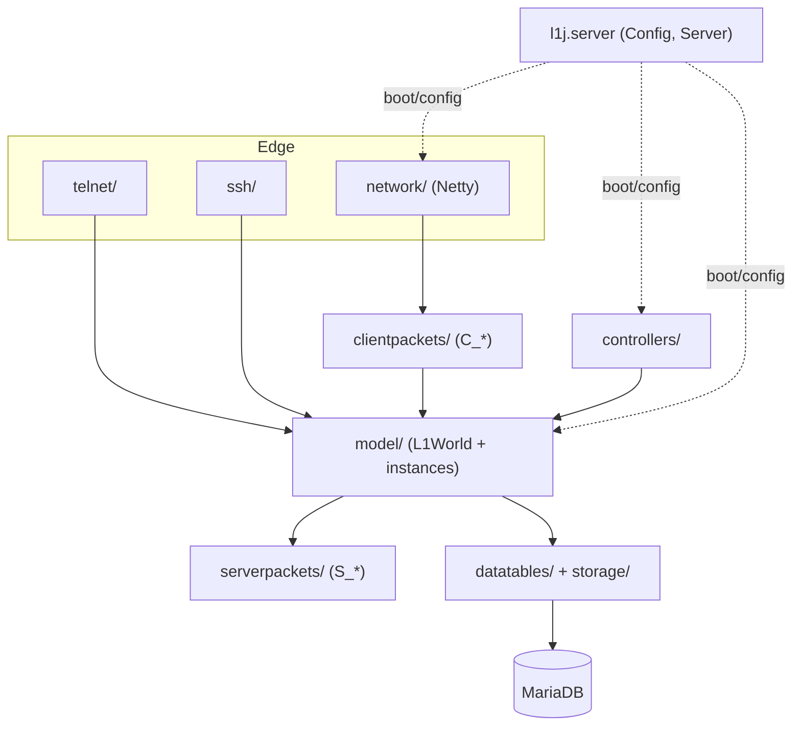
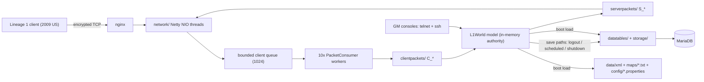

# Architecture Spine — l1j-en

## Design Paradigm

Layered single-JVM monolith. One process owns the whole game; layers map to packages under `src/l1j/server/`:

| Layer | Packages | Role |
| --- | --- | --- |
| Edge | `server/network/` (Netty), `telnet/`, `ssh/` | accept connections, decode/decrypt, expose GM consoles |
| Dispatch | `server/clientpackets/` (`C_*`), `server/serverpackets/` (`S_*`) | one class per wire packet, both directions |
| Domain | `server/model/` (`L1World` + instances) | all live game state and rules |
| Time | `server/controllers/` | recurring/timed game events |
| Persistence | `server/datatables/`, `server/storage/` | the only JDBC boundary; XML content loading |
| Config | `l1j.server` (`Config`, `Server`, `L1DatabaseFactory`) + `config/*.properties` | boot, settings, DB pool |

Threading is the paradigm's load-bearing detail: there is **no main game loop**. Game logic runs concurrently on a fixed pool of 10 `PacketConsumer` worker threads; `GeneralThreadPool` carries scheduled and offloaded work; telnet/ssh run their own threads. Safety is per-object, not global (AD-1).

## Invariants & Rules

### AD-1 — Concurrent worker-pool threading with per-object locking

- **Binds:** all
- **Prevents:** new code assuming a single-writer/main-thread model (upstream l1j has one; this fork does not) and silently widening the race surface with unlocked shared state.
- **Rule:** Game logic runs concurrently on the 10-thread `PacketConsumer` pool, `GeneralThreadPool`, and telnet/ssh GM threads. There is no main-thread guarantee and no global lock. Thread safety is per-object `synchronized` on the object owning the state (e.g. `Client`). New code mutating shared state must lock the object it mutates, following the existing per-object pattern. Any **new** shared mutable state must have an explicit, documented lock owner; the legacy no-lock pattern may be inherited but not extended.

### AD-2 — Memory is authority at runtime; content changes are stop-the-world

- **Binds:** all persistence, all content work
- **Prevents:** feature code writing player state straight to the DB (bypassing save paths) or assuming the DB reflects live state; hot-patching content under a running server and desyncing memory from disk.
- **Rule:** The in-memory `L1World` model is the authority while the server runs. The DB is a snapshot written only by save paths (logout / scheduled / shutdown) through `datatables/` + `storage/`; no feature code issues player-state SQL, and no runtime code reads the DB expecting live values. Content changes — `db/` SQL, `data/`, `maps/`, `config/` — are applied with the server stopped and take effect on boot.

### AD-3 — Wire protocol: frozen baseline, gated extensions

- **Binds:** `clientpackets/`, `serverpackets/`, `network/`
- **Prevents:** a feature changing the byte layout or semantics of an existing packet and breaking stock clients; and two features claiming the same new opcode.
- **Rule:** The byte layout and semantics of every existing packet are immutable — stock and modified clients alike depend on them. The server must keep supporting the unmodified 2009 US client. New features may add new packets/opcodes for modified clients, but stock-client behavior must not change: new server behavior is gated on client version/feature detection (`C_ClientVersion`), and stock clients must never receive packets they cannot parse. New opcodes are allocated in `encryptions/Opcodes.java` from the unused opcode space — one distinct unused value per feature, recorded in the change.

### AD-4 — Content placement: follow the kind

- **Binds:** all content work (`db/`, `data/`, `maps/`)
- **Prevents:** the same kind of content drifting into both layers, and ad-hoc hand-applied SQL that never lands in the repo.
- **Rule:** New static content goes in the same layer as the closest existing content of that kind (DB-driven content such as NPCs, spawns, drops, dungeons → SQL; XML-driven content such as item making, quests, teleporters, boss cycles → `data/xml/`). For an entirely new content kind with no closest match, default to DB (the dominant layer) unless the content is code-adjacent logic matching the XML pattern; note the choice in the change. Content is never moved between layers as a side effect of a feature. DB schema and content changes ship as versioned SQL files in `db/` following the `update_*.sql` pattern (optional/variant content in `db/optional/`); a change takes the next free `update_NNN.sql` number.

### AD-5 — Package placement: subpackage-first, flat root frozen

- **Binds:** all new Java code
- **Prevents:** the flat `l1j.server.server` root growing unboundedly and agents having no tiebreaker for where new code belongs.
- **Rule:** New classes go into the matching concern subpackage under `l1j.server.server` (`model/`, `clientpackets/`, `serverpackets/`, `controllers/`, `datatables/`, `storage/`, `command/`, `network/`, `taskmanager/`, `utils/`, `types/`, `encryptions/`, `log/`). No new classes directly in the flat root `l1j.server.server`; the root only shrinks as refactors move classes out.

### AD-6 — Dependency policy: permissive with a vendoring rule

- **Binds:** all code, `lib/`, `build.xml`
- **Prevents:** a feature quietly introducing a dependency that is neither vendored nor wired into the build, forking the dependency world.
- **Rule:** New third-party dependencies are allowed, but each must be vendored into `lib/` and added to the `build.xml` classpath in the same change, and noted in the change description. No restrictions on which dependencies.

### AD-7 — Single state owner per feature/event

- **Binds:** all feature work spanning multiple surfaces (events, GM commands, packets)
- **Prevents:** two units building one feature with two owners of its live state — e.g. an event team keeping state in its controller while a GM-command team reads a stale copy from the model (or vice versa).
- **Rule:** Every feature/event has exactly one home for its live state: world/player state lives in `model/` (objects owned by `L1World`); event-scoped state lives in that event's controller singleton, reachable only through its accessors — the existing `WarTimeController` pattern. No parallel copies of the same state in a second home; other surfaces (GM commands, packets) go through the owner's accessors.

Dependency direction (who may depend on whom):



## Consistency Conventions

| Concern | Convention |
| --- | --- |
| Naming | `C_*` / `S_*` for packet classes; `*Table` for datatables; `*Controller` for timed events; `L1*` for model classes |
| GM commands | New GM commands go through `command/` + `GMCommands` / `pcommands.properties` registration — no new parallel command surface |
| Recurring events | New timed/recurring events follow the `controllers/` pattern (controller class + registration in `GameServerThread`); scheduled work via `GeneralThreadPool`; no raw `Timer` / `Thread.sleep` loops in feature code |
| Content SQL | One content change = one `db/update_NNN.sql` taking the next free number; optional/variant content in `db/optional/` |
| Configuration | Runtime-tunable values live in `config/*.properties` read through `Config`; no hardcoded rates, ports, or flags in feature code |
| Logging | slf4j only, one logger per class; no `System.out` |
| Verification | Until a test strategy is adopted, review against this spine (AD-1..AD-7 + conventions) is the sole verification gate for new work |
| Opcodes | New client opcodes are allocated in `encryptions/Opcodes.java` from the unused space, one distinct value per feature (AD-3) |
| State & cross-cutting | Per-object `synchronized` for shared mutable state (AD-1); DB access only via `datatables/` + `storage/` (AD-2) |

## Stack

Seed — verified against the repo on 2026-08-28; the code owns this from here.

| Name | Version |
| --- | --- |
| Java (JDK, no source/target pinned in `build.xml`; README: Java 9+) | 9+ |
| Apache Ant (build) | whatever installs; `build.xml` targets clean/compile/jar |
| Netty | 4.1.29.Final |
| mysql-connector-java | 5.1.31 |
| BoneCP / c3p0 (DB pools) | 0.8.0.RELEASE / 0.9.1.2 |
| javolution | 5.2.6 |
| Guava | 17.0 |
| slf4j-api / slf4j-jdk14 | 1.7.5 / 1.7.25 vendored — ⚠ build.xml classpath lists `slf4j-jdk14-1.7.5.jar`, which is not in `lib/` (repo inconsistency) |
| c3p0 | 0.9.1.2 in build.xml classpath — ⚠ no jar in `lib/` (repo inconsistency; BoneCP is the pool actually used) |
| Apache sshd-core | 1.2.0 |
| JAXB / javax.activation | 2.3.1 / 1.2.0 |
| MariaDB (Docker) | 12.0.2 |
| nginx + Docker Compose | per `docker-compose.yaml` / `nginx.conf` |

## Structural Seed

Runtime topology:



Data layers (what owns what):

| Layer | Owns | Lives in |
| --- | --- | --- |
| MariaDB | player state + most static content (npc, spawnlist, droplist, dungeon, shop, npcaction…) | `db/` (schema + `update_*.sql`) |
| XML | slice of static content (item making, quests, teleporters, boss cycles, treasure boxes) | `data/xml/` |
| Map files | world geometry, one tile-grid file per map (567 maps) | `maps/<mapid>.txt` |
| Properties | server/runtime configuration | `config/*.properties` |

Minimal source tree:

```text
src/l1j/server/
  Server.java            # main() → GameServer.initialize()
  Config.java            # all config/*.properties access
  L1DatabaseFactory.java # DB pool (BoneCP)
  server/                # flat root — FROZEN (AD-5): GameServer, GameServerThread,
                         #   GeneralThreadPool, GMCommands, Shutdown, …
  server/network/        # Netty bootstrap, decode/decrypt, client queue
  server/clientpackets/  # 88 C_* handlers
  server/serverpackets/  # 159 S_* packets
  server/model/          # L1World + all game entities (Instance/, item/, map/, …)
  server/controllers/    # timed event controllers
  server/datatables/     # 55+ *Table loaders, the XML+JDBC content boundary
  server/storage/        # JDBC write paths (characters, items, traps)
  server/command/        # GM command implementations
  server/taskmanager/    # timer infrastructure
telnet/  ssh/            # GM consoles (own threads, AD-1 exception surface)
```

## Deferred

| Decision | Why it can wait |
| --- | --- |
| Build system (Ant → Gradle/Maven) | Modernization is a deliberate spine amendment, not a current invariant (ratify-as-is scope) |
| Java version pinning / upgrade | Same — no source/target pinned today; decide with the build migration |
| Verification / test policy | No test infra exists (no JUnit in `lib/`, no test sources); revisit when a test strategy is chosen |
| Lock retrofit for telnet/ssh GM paths | Known race surface, trusted to be limited to those interfaces; fix is a refactor, not a new-feature blocker |
| Legacy no-lock hot paths in `model/` | Inheritable per AD-1; auditing is a dedicated effort, not a feature gate |
| DB migration tooling | Manual versioned SQL in `db/` works; tooling is a convenience, not an invariant |
| Environments (dev/test/prod topology) | Single environment definition today (Docker Compose + `.env`); decide when a second environment appears |
| Scaling / HA / multi-node | Single-node Docker Compose is the envelope; no second node to design for yet |
| Shrinking the frozen flat root | AD-5 only forbids growth; moving existing classes out is optional refactor work |
